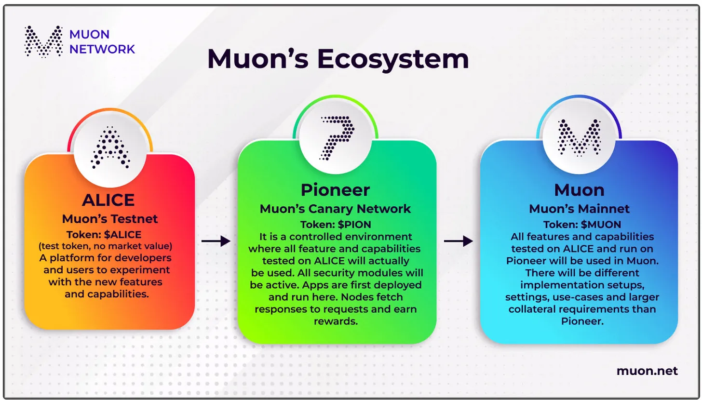
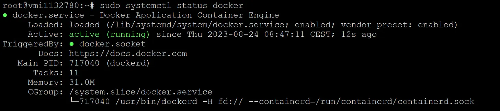
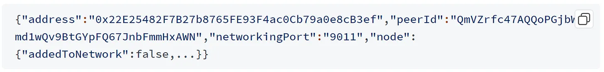
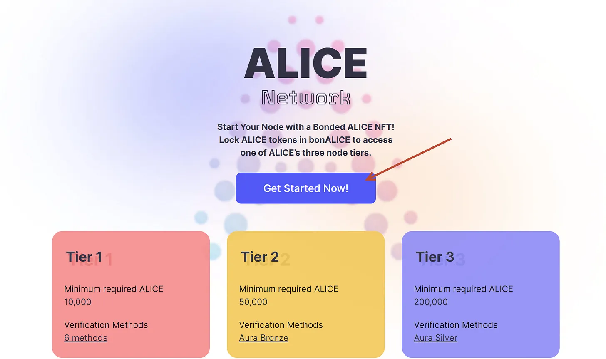
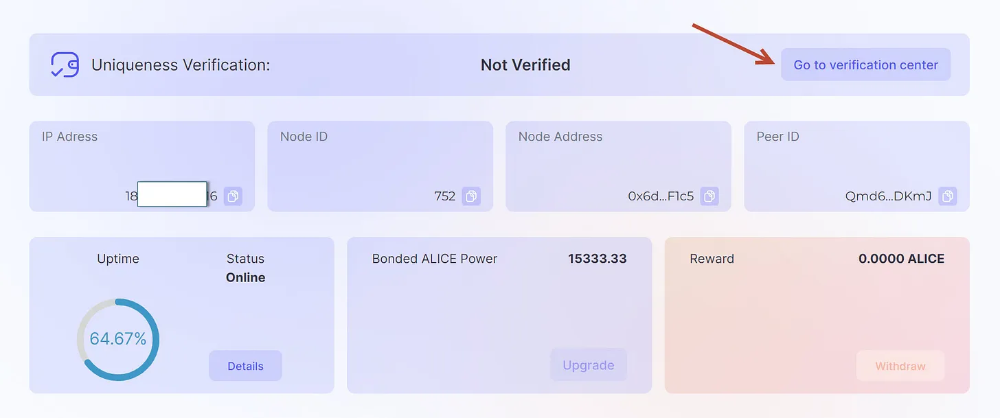

# Node MUON Alice-v2

<figure><figcaption></figcaption></figure>

Telegram: [https://t.me/VNBnodegroup](https://t.me/VNBnodegroup)

X (Twitter): [https://x.com/vnbnode](https://x.com/vnbnode)

1.  **ROADMAP**

    MUON đã qua giai đoạn ALICE test và bước vào giai đoạn PIONNER với tên gọi Alice-v2. VNBNodes sẽ hướng dẫn cho các bạn cài đặt Node Alice-v2
2.  **CÀI DOCKER**

    ```
    sudo apt update
    ```

    * Cài đặt một số gói cho phép cài đặt qua HTTPS

    
    ```
    sudo apt install apt-transport-https ca-certificates curl software-properties-common
    ```
    

    * Thêm khóa GPG của kho lưu trữ Docker

    
    ```
    curl -fsSL https://download.docker.com/linux/ubuntu/gpg | sudo gpg --dearmor -o /usr/share/keyrings/docker-archive-keyring.gpg
    ```
    

    * Thêm kho lưu trữ Docker vào APT source

    
    ```
    echo "deb [arch=$(dpkg --print-architecture) signed-by=/usr/share/keyrings/docker-archive-keyring.gpg] https://download.docker.com/linux/ubuntu $(lsb_release -cs) stable" | sudo tee /etc/apt/sources.list.d/docker.list > /dev/null
    ```
    

    * Cài đặt package và thiết lập cài đặt Docker từ kho lưu trữ chính:

    ```
    sudo apt update
    ```

    ```
    apt-cache policy docker-ce
    ```

    * Cài đặt Docker:

    ```
    sudo apt install docker-ce
    ```

    * Kiểm tra trạng thái của Docker. Thấy ra màn hình như ảnh là ok.

    <pre><code><strong>sudo systemctl status docker
    </strong></code></pre>


    <figure><figcaption></figcaption></figure>

&#x20;             Ấn Q để thoát khỏi màn hình.

1.  **CÀI ĐẶT MUON NODE**

    1.  Nếu đã cài đặt Muon Node thì cần Stop và remove node cũ

        ```
        docker stop muon-node mongo redis
        ```

        ```
        docker rm muon-node mongo redis
        ```
    2.  Kéo File _docker-compose.yml_ về + Pull image:

        
        ```
        curl -o docker-compose.yml https://raw.githubusercontent.com/muon-protocol/muon-node-js/alice-v2/docker-compose-pull.yml
        ```
        

        <pre><code><strong>docker compose pull
        </strong></code></pre>
    3.  RUN

        ```
        docker compose up -d
        ```
    4.  Xem kết quả:

        ```
        curl http://localhost:8011/status
        ```

        Localhost là địa chỉ ip server của bạn. Ví dụ: curl _http://192.168.1.255:8011/status_

        Nếu thấy hiện ra dòng thông tin như ảnh là ok.

    <figure><figcaption></figcaption></figure>
2. **THÊM NODE VÀO ALICE DASHBOARD**
   1.  Truy cập dashboard và click “Get Start”

       <figure><figcaption></figcaption></figure>
   2. Claim Node drop
   3. Verify node
   4. Claim
   5. Select » Bon ALICE
   6. Approve và Thành công sẽ có thông báo như ảnh.
   7.  **Verify Node**

       Sau khi add Node vào dashboard các bạn sẽ nhìn thấy Node: “_Not Verify_”. Click vào “_Go to verification center_” và lần lượt verify từng cách một. Như tôi chỉ verify đc 4/6 cách.

       <figure><figcaption></figcaption></figure>

       Nếu thấy bài viết có ích, các bạn hãy Share bài viết để nhóm VNBNodes có động lực viết các bài viết có chất lượng cho cộng đồng.

       Hãy tham gia Telegram để nhận được thông tin Testnet + bài viết nghiên cứu dự án sớm nhất: [https://t.me/Vnbnode](https://t.me/Vnbnode)

       _Tác giả: TrieuNguyen VNBnodes member_
