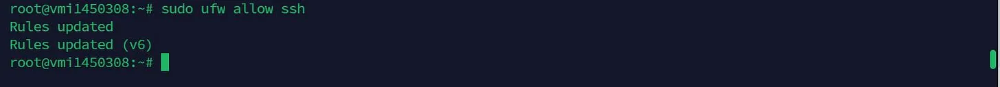
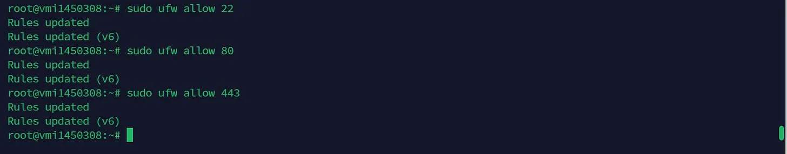
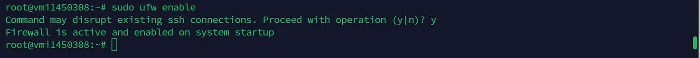

# Guide to install AR io node

Hệ sinh thái AR.IO cam kết phát triển các sản phẩm và giao thức để duy trì việc truy cập vào tính bền vững của dữ liệu kỹ thuật số, giúp cho permaweb trở nên dễ dàng tiếp cận với mọi người. Mạng lưới toàn cầu của các Gateway này kết nối người dùng đến dữ liệu, tệp tin, ứng dụng và trang web được lưu trữ vĩnh viễn trên mạng lưu trữ phi tập trung Arweave.

## **Minimum requirements**

* 4 core CPU
* 4 GB Ram
* 500 GB storage (SSD recommended)
* Stable 50 Mbps internet connection

### **Recommended**

* 12 core CPU
* 32 GB Ram
* 2 TB SSD storage
* Stable 1 Gbps internet connection

### **Step 1: Install packages**


```
sudo apt update -y && sudo apt upgrade -y && sudo apt install -y curl openssh-server docker-compose git certbot nginx sqlite3 build-essential && sudo systemctl enable ssh && curl -sSL https://dl.yarnpkg.com/debian/pubkey.gpg | sudo apt-key add - && echo "deb https://dl.yarnpkg.com/debian/ stable main" | sudo tee /etc/apt/sources.list.d/yarn.list && sudo apt-get update -y && sudo apt-get install -y yarn && curl -o- https://raw.githubusercontent.com/nvm-sh/nvm/v0.39.0/install.sh | bash && source ~/.bashrc && sudo ufw allow 22 80 443 && sudo ufw enable
```



<figure><figcaption></figcaption></figure>


```
nvm install 16.15.1 && nvm use 16.15.1
```


<figure><figcaption></figcaption></figure>

### **Step 2: Update your software:**

```
sudo apt update
sudo apt upgrade
```


### **Step 3: Open your ports**

```
sudo ufw disable
```

<figure><figcaption></figcaption></figure>

```
sudo ufw default allow
```

<figure><figcaption></figcaption></figure>

```
sudo ufw allow ssh
```

<figure><figcaption></figcaption></figure>

```
sudo ufw allow 22
sudo ufw allow 80
sudo ufw allow 443
```

<figure><figcaption></figcaption></figure>

```
sudo ufw enable
```

<figure><figcaption></figcaption></figure>

```
sudo ufw status numbered
```


### **Step 4: Install nginx:**

```
sudo apt install nginx -y
```

<figure><figcaption></figcaption></figure>

### **Step 5: Install git:**

```
sudo apt install git -y
```

### **Step 6: Install docker:**


```
sudo apt install docker-compose -y
```



* Test Docker installation:

```
sudo docker run hello-world
```

<figure><figcaption></figcaption></figure>

### **Step 7: Install Certbot:**

```
sudo apt install certbot -y
```

<figure><figcaption></figcaption></figure>

### **Step 8: Install ssh**


```
sudo apt install openssh-server -y
sudo systemctl enable ssh
```


<figure><figcaption></figcaption></figure>

### **Step 9: Install Yarn:**


```
curl -sSL https://dl.yarnpkg.com/debian/pubkey.gpg | sudo apt-key add -      echo "deb https://dl.yarnpkg.com/debian/ stable main" | sudo tee /etc/apt/sources.list.d/yarn.list
```


```
sudo apt-get update -y
```

```
sudo apt-get install yarn -y
```

<figure><figcaption></figcaption></figure>

### **Step 10: Install NVM (Node Version Manager):**


```
curl -o- https://raw.githubusercontent.com/nvm-sh/nvm/v0.39.0/install.sh | bash source ~/.bashrc
```


<figure><figcaption></figcaption></figure>

### **Step 11: Install Node.js:**

```
nvm install 16.15.1
```

<figure><figcaption></figcaption></figure>

### **Step 12: Install build tools**

```
sudo apt install build-essential
```

<figure><figcaption></figcaption></figure>

#### **Step 13: Install SQLite:**

```
sudo apt install sqlite3 -y
```

<figure><figcaption></figcaption></figure>

## Install the Node

### **Step 14: Clone the ar-io-node repository and navigate into it:**

```
git clone https://github.com/ar-io/ar-io-node
cd ar-io-node
```

<figure><figcaption></figcaption></figure>

**Step 15: Create an environment file:**

```
nano .env
```

<figure><figcaption></figcaption></figure>

Paste the following into the file and save.

```
GRAPHQL_HOST=arweave.net
GRAPHQL_PORT=443
START_HEIGHT=1000000
ARNS_ROOT_HOST=<your-domain>
```

Replace \<your-domain> with the domain address, for your node.

To get free domain, you can try: [https://www.hostinger.com/free-domain](https://www.hostinger.com/free-domain) or other sources.

With VPS, you can try with

```
 hostname -f
```

### **Step 16: Build the Docker container:**


```
sudo docker-compose up -d --build
```


<figure><figcaption></figcaption></figure>

### **Step 17: Check the logs for errors:**


```
sudo docker-compose logs -f --tail=0
```


<figure><figcaption></figcaption></figure>

